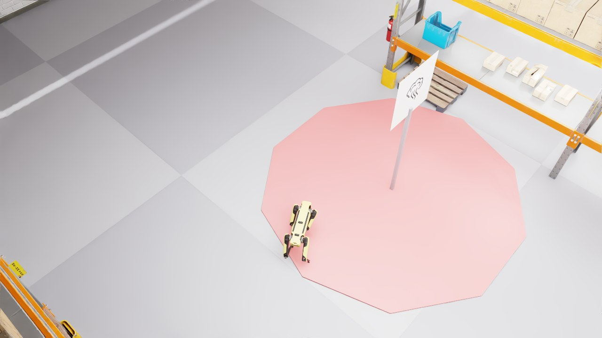

# spot-llm-inspection

Confidence-guided selective escalation for LLM–human collaborative factory
inspection.

A SPOT robot patrols a simulated factory in Isaac Sim. On detecting an anomaly,
an LLM makes a two-tier decision grounded in Korean industrial-safety law and
escalates to a human operator when its confidence is low.



*SPOT holding an observation stance inside a SMOKE_DETECTED zone. The marker
pole shows the anomaly type; the shaded octagon is the 2.5 m detection radius.*

## Framework

```
patrol → anomaly detected
  ↓
[Tier 1 — observation stance]  APPROACH · WAIT_AND_OBSERVE · KEEP_DISTANCE
  ↓  (SPOT physically executes it)
[Tier 2 — resolution]          EMERGENCY · MAINTENANCE · CONTINUE · FALSE_ALARM
  ├─ fixed      rule-based
  ├─ llm_full   LLM decides directly, no escalation
  └─ llm_hitl   low confidence → escalate to the oracle
```

All three conditions are scored on the same events in a single run, so the
comparison is paired. SPOT's motion follows the `llm_hitl` decision. Legal
principles (화재예방법 §40, 소방기본법 §20, etc.) are injected as prompt
principles rather than lookup rules — that is what makes generalization to
unseen anomaly types possible.

Spec: [`docs/ARCHITECTURE.md`](docs/ARCHITECTURE.md).


*Patrol leg between two zones — FIRE_RISK in the foreground, another ahead.
Anomaly type and attributes are resampled every lap from the type's pool.*

## Results

4 models (Haiku 4.5, Sonnet 4.6, GPT-4o mini, Llama 3.1) × 10 laps = 196
decisions. 4 in-distribution anomaly types + 3 held out as OOD.

| | Fixed | LLM-Full | LLM+HiTL |
|---|---|---|---|
| Tier 2 dangerous under-response | 44.9 % | 5.6 % | **1.5 %** |
| EMERGENCY miss | 76.0 % | 7.0 % | **0.0 %** |
| EMERGENCY miss (OOD) | **100 %** | 9.4 % | **0.0 %** |

Delegating by confidence rank reaches 98 % safety at 25 % human help and 100 %
at 65 %. Raw confidence is overconfident (ECE 30.5 %); temperature scaling at
T = 7.0 fixes the mean (ECE 4.7 %) but is monotonic, so the delegation curve is
unchanged.

Caveats: ground truth is an author-written rule set, not expert labels; the
oracle is a perfect human, so LLM+HiTL is an upper bound; N = 196, single seed.
The LLM's binary self-escalation flag fires far too often (85 %) — use the
confidence ranking with a calibrated threshold instead.

## Setup

```bash
python tests/smoke_test_v2.py
```

With simulation — needs [Isaac Sim 5.0](https://docs.isaacsim.omniverse.nvidia.com/latest/installation/).

```bash
pip install -r requirements.txt
cp .env.example .env
```

| alias | provider | needs |
|---|---|---|
| `haiku`, `sonnet` | Anthropic | `ANTHROPIC_API_KEY` |
| `gpt4o` | OpenAI | `OPENAI_API_KEY` |
| `llama` | Ollama | `ollama serve && ollama pull llama3.1` |

## Run

```bash
python src/spot_factory_v2.py --models haiku sonnet gpt4o llama --laps 10 --seed 42
```

Other flags: `--headless`, `--follow-cam`, `--speed {1,2,3,4}`, `--record`
(one PNG per frame, several GB per run), `--output`, `--log-dir`.

## Layout

```
src/        anomaly_config · llm_decision · oracle · metrics_collector · spot_factory_v2-
tests/      smoke_test_v2.py
policies/   pretrained SPOT locomotion policy + env config
```

## License

MIT
